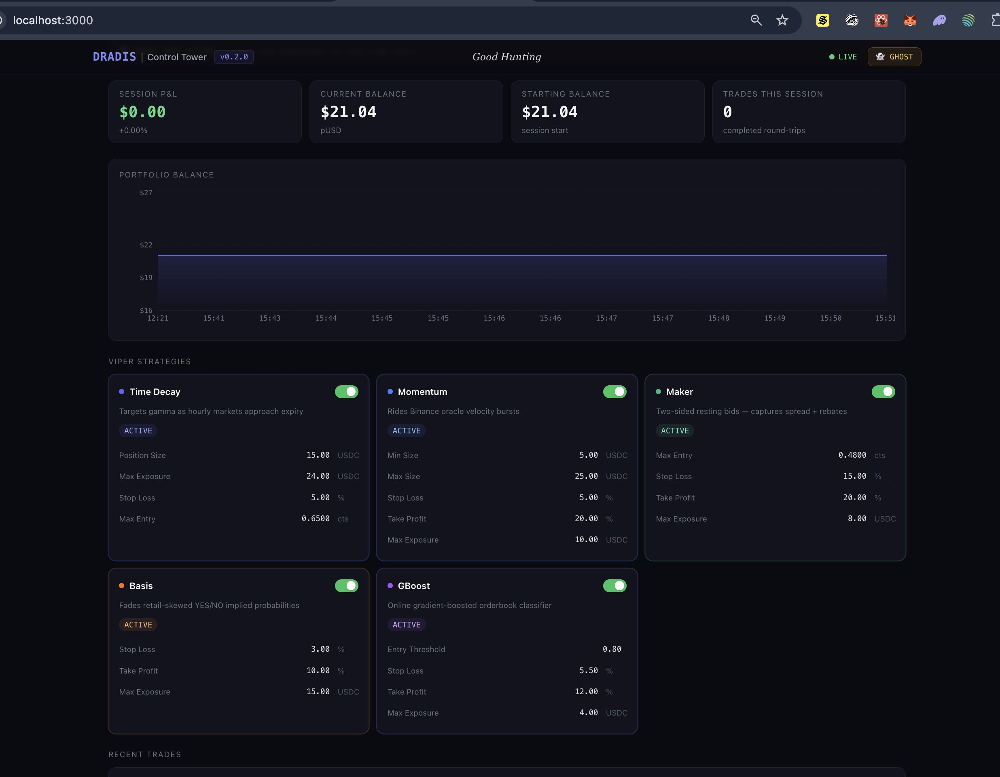

# DRADIS

> **Direct Reaction And Dynamic Intelligence System** — Low-latency Rust prediction-market trading bot for Kalshi & Polymarket. Nine autonomous Viper strategies, a Raptor recon layer (Price, Funding, Derivatives, Tide "Institutional Pulse", Horizon "TradFi Velocity", a venue-neutral Sports line-movement scout, and a venue-neutral Tennis event-state scout), a Squadron deployment framework, a CAG async dispatch layer with concurrent multi-asset support, a real-time Next.js Control Tower, and an LLM Advisor (Ollama local/remote, OpenAI-compatible, or Anthropic) that delivers optimization recommendations via Telegram & OpenClaw — and can propose or autonomously apply live config changes under a tiered, guard-railed autonomy policy.


[](https://openclaw.ai)
[](LICENSE)
[](https://aws.amazon.com/marketplace/pp/prodview-dv5dats2bmm5q)

**WARNING**: You will probably lose money. Start in GHOST mode and tune before going live. Make sure to regularly pull updates as our own LLM advises on config and Viper strategy impls often.

Public Demo Site: https://demo.dradis.live/

## Two ways to run it

**Prebuilt AMI — [AWS Marketplace](https://aws.amazon.com/marketplace/pp/prodview-dv5dats2bmm5q)**
Launches a configured instance in your own AWS account. All three venues ship in
the image, the Control Tower comes with it, and your API keys stay on your
infrastructure. Marketplace subscribers receive a **commercial license**, not the
AGPL, so the copyleft obligations below do not apply to that deployment.
Install and upgrade guides: <https://dradis.live/docs>

**From source — this repository**
Clone, pick a risk profile, run it with Docker. The full engine, all nine
strategies and the Control Tower are here; nothing is held back for the paid
image. **AGPL v3** — see [LICENSE](LICENSE).

The rest of this README covers the source route.


---


## ️ Tactical Overview

DRADIS is a comprehensive trading automation platform for prediction markets. Built in Rust for maximum concurrency and memory safety, it evaluates selected markets every 50ms, coordinating multiple autonomous strategies to preserve capital and place orders where it sees inefficiencies.

The system is organized around four BSG-inspired tactical layers:

| Layer        | Folder          | Role                                                                           |
|--------------|-----------------|--------------------------------------------------------------------------------|
| **Raptors**  | `src/raptors/`  | Signal scouts — fetch, normalise, broadcast external data                      |
| **Vipers**   | `src/vipers/`   | Trading strategies — evaluate signals and place orders                         |
| **Squadron** | `src/squadron/` | Deployment unit — bundles Raptors + Vipers onto a battle location              |
| **CAG**      | `src/cag/`      | Commander Air Group — async dispatch, session state, multi-asset orchestration |


---

## ⚡ Quick Start

```bash
# 1. Clone and configure
git clone https://github.com/youruser/dradis.git && cd dradis
cp .env.example .env          # fill in POLYMARKET_PRIVATE_KEY, POLYGON_RPC_URL, TELEGRAM tokens, etc.

# If deploying remotely:
cp deploy-multi.sh.example deploy-multi.sh  # fill in HOST, USER, KEY

# choose one config profile and copy it into src/config.rs before building
cp src/config.balanced.rs.example src/config.rs   # or conservative/aggressive
```

```bash
# 2. Select the appropriate venue (builds Rust engine + Control Tower)

# Start Polymarket INTL clob default
./start-local.sh                  # Intl CLOB, BTC (default)

# Or start Polymarket US API
VENUE=us ./start-local.sh        # US Retail venue (us_retail build)

# Or start Kalshi (demo-friendly — see Kalshi configuration below)
VENUE=kalshi ./start-local.sh    # Kalshi venue (kalshi build)

# optionally start with verbose logging
RUST_LOG=debug ./start-local.sh  # verbose logging

tail -f logs/dradis-local.log
./stop-local.sh
```

After ~5 minutes the stack is live:

| Service             | URL                                       |
|---------------------|-------------------------------------------|
| **Control Tower**   | `http://<host>:3002`                      |
| **DRADIS REST API** | `http://<host>:9000/api/health`           |
| **Ollama**          | `http://<host>:11434/api/tags` (internal) |

> **Prerequisites:** Docker on the remote host, Rust 1.95+ only needed for local builds.

---

##  Choosing a venue 

DRADIS compiles for **exactly one** execution venue, chosen at build time via a Cargo
feature. All venues share the same strategy/abstraction layers through the venue-neutral
`Execution` trait (`src/venues/core.rs`) and the shared `OrderLifecycle` reconciler
(`src/venues/lifecycle.rs`); only the venue module differs, so the unused venues'
dependencies are stripped from the binary.

| Feature              | Venue                              | Auth                                   | Gateway                              |
|----------------------|------------------------------------|----------------------------------------|--------------------------------------|
| `intl_clob` *(default)* | Polymarket International (self-custody) | EOA wallet + EIP-712 over Polygon      | `clob.polymarket.com`                |
| `us_retail`          | Polymarket US (custodial, CFTC)    | Ed25519 challenge-response → JWT        | `api.prod.polymarketexchange.com`    |
| `kalshi`             | Kalshi (custodial, CFTC)           | RSA-PSS request signing                 | `external-api.kalshi.com` (demo: `external-api.demo.kalshi.co`) |

### Start locally

```bash
# Polymarket Intl CLOB (default)
./start-local.sh                  # BTC
./start-local.sh eth              # ETH

# Polymarket US Retail
VENUE=us ./start-local.sh

# Kalshi
VENUE=kalshi ./start-local.sh
```

### Build manually

```bash
# International CLOB (default)
cargo build --release
cargo test

# US Retail
cargo build  --release --no-default-features --features us_retail
cargo test            --no-default-features --features us_retail

# Kalshi
cargo build  --release --no-default-features --features kalshi
cargo test            --no-default-features --features kalshi
```

### Polymarket US Retail configuration (`.env`)

```bash
POLYMARKET_US_KEY_ID=<key-id-uuid>      # developer-portal Key ID (X-PM-Access-Key)
POLYMARKET_US_SECRET_KEY=<base64-secret> # portal Secret Key (Base64 Ed25519 keypair), shown once
# optional:
POLYMARKET_US_BASE_URL=https://api.prod.polymarketexchange.com  # override (staging/mock)
POLYMARKET_US_TRADE_SIZE=10        # contracts per leg          (default 10)
POLYMARKET_US_ARB_EDGE=0.02        # min risk-free edge per pair (default $0.02)
POLYMARKET_US_MARKET_FILTER=chiefs # optional slug/question substring to pick a market
ASSETS=us                          # keep the dashboard pool tidy (US data lives in logs/us-dradis.db)
```

> **Polymarket US Retail status:** the MVP loop (`src/venues/us/trader.rs`) runs the venue-agnostic
> **arbitrage** strategy — discover a binary market → stream both legs over WebSocket →
> buy `YES`+`NO` for < $1 via an **engine-atomic** batched order (`/v1/orders/batched`) →
> reconcile via `OrderLifecycle`. Open positions and portfolio P&L appear in the Control Tower under the **`us`**
> asset selector. The Control Tower API stays live on `:9000` regardless. A second
> **crypto wing** (`us-crypto` asset) hunts crypto-class markets with the full Raptor
> stack, so all nine Vipers fly on them.

### Kalshi configuration (`.env`)

Kalshi signs every request locally with **RSA-PSS** — create an API key in your
account settings (Key ID + downloadable RSA private key PEM, shown once).

**Try it risk-free on the demo exchange** — [demo.kalshi.co](https://demo.kalshi.co)
is a full paper-trading environment with play money and the same live crypto markets;
demo credentials are separate from production.

```bash
KALSHI_API_KEY_ID=<key-id-uuid>          # from account settings (REQUIRED)
KALSHI_PRIVATE_KEY_PATH=data/kalshi-key.pem  # downloaded PEM (REQUIRED; or KALSHI_PRIVATE_KEY=<pem contents>)
KALSHI_DEMO=1                            # 1 = demo.kalshi.co paper trading, unset = production
# optional:
KALSHI_SERIES=KXBTC15M,KXBTCD,KXETH15M,KXETHD  # crypto series to hunt (default shown)
KALSHI_MARKET_FILTER=bitcoin             # optional ticker/title substring to pick a market
ASSETS=kalshi                            # keep the dashboard pool tidy (data in logs/kalshi-dradis.db)
```

> **Kalshi status:** the loop (`src/venues/kalshi/trader.rs`) is **crypto-first** —
> it discovers the hottest open market across the configured series (15-minute and
> hourly BTC/ETH by default), classifies it via the shared taxonomy, and flies **all
> nine Vipers** with the full Raptor intelligence stack. Order books stream over the
> authenticated WebSocket (`orderbook_delta` with sequence-gap recovery) and fills
> confirm event-precisely via the private `fill` channel. Kalshi's quadratic taker
> fee (max 1.75¢/contract at P=0.50) is priced into Viper edge thresholds. Positions
> and P&L appear under the **`kalshi`** asset selector.

---

## ️ Architecture

```
┌─────────────────────────────────────────────────────────────────────┐
│                         src/ layout                                 │
│                                                                     │
│  raptors/          ← Signal scouts (Binance WS + FAPI, The Odds API)│
│  vipers/           ← Trading strategies (8 Vipers)                  │
│  squadron/         ← Deployment layer (Raptor+Viper+Market bundle)  │
│  cag/              ← Commander (async dispatch, multi-asset)        │
│  orchestrator/     ← Strategy trait, registry, executor             │
│  tasks/            ← Market monitor, cleanup, chain-sync            │
│  helpers/          ← DB, orders, balance, metrics, notifications    │
│  api/              ← axum REST server (:9000)                       │
└─────────────────────────────────────────────────────────────────────┘
```

```
┌──────────────────────┐   ┌──────────────────────┐
│    src/raptors/      │   │  Polymarket CLOB     │
│  Price Raptor        │   │  (WebSocket Feed)    │
│  (Binance Spot WS)   │   │                      │
│  Funding Raptor      │   │                      │
│  (Binance FAPI REST) │   │                      │
│  Derivatives Raptor  │   │                      │
│  (Binance FAPI: OI)  │   │                      │
│  Tide Raptor         │   │                      │
│  (Alpaca IEX + iNAV) │   │                      │
│  Horizon Raptor      │   │                      │
│  (SPY/QQQ/UVXY)      │   │                      │
│  Sports Raptor       │   │                      │
│  (The Odds API)      │   │                      │
└──────────┬───────────┘   └───────────┬──────────┘
           │  watch channels           │ orderbook WS
           └─────────────┬─────────────┘
                         ▼
           ┌─────────────────────────┐
           │   src/cag/              │  ← CAG (Commander Air Group)
           │   run_market_loop()     │  ← one tokio task per asset
           │   SessionState          │  ← per-asset P&L + collateral
           └─────────────┬───────────┘
                         │  (BTC task) (ETH task) (SOL task) …
                         ▼
           ┌─────────────────────────┐
           │   src/squadron/         │
           │   Squadron descriptor   │  ← SquadronRaptors (signal bundle)
           │   (battle location +    │  ← SquadronConfig  (which Vipers fly)
           │   Raptor+Viper bundle)  │  ← SquadronState   (STAGED→PATROLLING→RTB)
           └─────────────┬───────────┘
                         ▼
           ┌─────────────────────────┐
           │   Orchestrator (CIC)    │◄──── axum REST API (:9000)
           │     50ms Heartbeat      │
           └─────────────┬───────────┘
                         │  parallel dispatch
           ┌─────────────┼───────────────┬───────────────┬──────────────┐
           ▼             ▼               ▼               ▼              ▼
    ┌────────────┐ ┌──────────┐ ┌───────────────┐ ┌────────────┐ ┌──────────────┐
    │ Momentum/  │ │  Maker   │ │  Arbitrage /  │ │   GBoost   │ │ TrendCapture │
    │ FairValue  │ │  Viper   │ │  TimeDecay /  │ │    Viper   │ │    Viper     │
    │   Viper    │ │          │ │  Basis Vipers │ │   (ML)     │ │ (drift/trend)│
    └──────┬─────┘ └────┬─────┘ └──────┬────────┘ └─────┬──────┘ └──────┬───────┘
           └────────────┼──────────────┴────────────────┴───────────────┘
                        ▼
           ┌───────────────────────┐
           │    Execution Layer    │
           │  OBI Gate · Fee Gate  │
           │  Circuit Breaker      │
           └───────────────────────┘

           ┌───────────────────────┐
           │   Control Tower UI    │  Next.js dashboard (:3002)
           │  Viper toggles        │  ◄── PATCH /api/config
           │  P&L chart            │  ◄── GET  /api/pnl/history
           │  Open Positions       │  ◄── GET  /api/positions
           │  Trade log            │  ◄── GET  /api/trades
           └───────────────────────┘

           ┌───────────────────────┐     ┌────────────────┐
           │    LLM Advisor        │────►│  Ollama API    │
           │  (background task)    │     │  (your model)  │
           └──────────┬────────────┘     └────────────────┘
                      ▼
           ┌───────────────────────┐
           │   Telegram Channel    │
           └───────────────────────┘
```

### Core design principles

- **Parallel Dispatch**: Every 50ms heartbeat, the CIC evaluates all registered Vipers concurrently.
- **Isolated budgets**: Each Viper has its own independent capital budget and position book — a loss in one sector can't drain another's fuel.
- **Multi-asset concurrency**: Each asset runs in its own `tokio::spawn`ed task with independent raptors and session state. The tokio runtime sizes its worker pool to the host's core count (floor 2) to avoid oversubscribing small instances; set `TOKIO_WORKER_THREADS` to raise it for multi-asset boxes (e.g. BTC + ETH + SOL on a 4+ vCPU host). Blocking work runs on the dedicated `spawn_blocking` pool, so matching workers to cores is the correct configuration.
- **OS-thread watchdog**: A native OS thread (outside the tokio runtime) checks an atomic heartbeat every 60 s. If the trading loop goes silent for 5 minutes, it calls `process::exit(1)` to trigger Docker's restart policy — immune to tokio runtime deadlocks. It stands down while the engine is deliberately parked awaiting Setup, so a box with no credentials yet is not mistaken for a stalled one. On a stall it dumps every thread's stack before exiting — see Diagnosing a stall below.
- **OBI Veto**: A built-in Order Book Imbalance gate at −0.60 blocks entries into toxic flow / distribution walls.
- **Strategy Timeout**: Each Viper evaluation is hard-capped at 500ms. A hung Viper is skipped for that tick — the engine never freezes.
- **REST API**: axum server on `:9000` exposes live config, P&L, positions, and trade history to the Control Tower.

### Diagnosing a stall

If the trading loop goes quiet, the OS-thread watchdog emits a soft warning at
180 s and exits the process at 300 s so the supervisor restarts it. Both points
dump the stack of **every** thread, and the soft warning is usually the more
useful of the two: the process is still alive there, so whatever holds a lock is
still holding it.

The dump names the phase the loop was in (`SIGNAL_EVAL`, `MARKET_ROTATE`,
`GBOOST_RETRAIN`, …) and, inside signal evaluation, which viper or setup step.
That alone is often enough. When it is not, the stacks need symbolizing:

- **Release builds carry line tables** (`[profile.release] debug = 1`). Debug
  info does not change code generation — the binary runs exactly as it would
  without it.
- **The runtime image is stripped**, so the shipped binary stays small. The
  matching **unstripped** binaries are published with each AMI release as
  `dradis-debuginfo-v1.0.0-ami.N.tar.gz`.
- Symbolize a customer's dump against the tarball **for the version they are
  running** — the addresses are meaningless against any other build.

```bash
# macOS
atos -o dradis-intl.debug -arch arm64 -l <LoadAddress> <address>
# Linux
eu-addr2line -e dradis-intl.debug -f -C <address>
```

The load address is printed at the top of the dump. A mismatch between binary
and symbols yields confident nonsense rather than an error, so check the version
before trusting a result.

### REST API Endpoints

| Endpoint | Method | Description |
|----------|--------|-------------|
| `/api/health` | GET | Liveness check |
| `/api/assets` | GET | List initialized asset pools |
| `/api/config` | GET | Current DynamicConfig as JSON |
| `/api/config` | PATCH | JSON merge-patch — hot-reloads strategies |
| `/api/config/schema` | GET | Editable-config field schema |
| `/api/pnl/history` | GET | Recent P&L snapshots |
| `/api/trades` | GET | Recent completed trades |
| `/api/positions` | GET | Current open positions |
| `/api/squadrons` | GET | List all active squadrons |
| `/api/squadrons/{id}` | GET | Get one squadron by id |
| `/api/squadrons/{id}/config` | GET/PATCH | Squadron-specific config |
| `/api/squadrons/deploy` | POST | Queue a new squadron deployment |
| `/api/deployments` | GET | List deployment queue status |
| `/api/deployment/region` | GET | Region + available market types |
| `/api/markets/available` | GET | Fetch markets by type from Gamma API |
| `/api/taxonomy/raptors` | GET | Raptor kinds for market class |
| `/api/taxonomy/vipers` | GET | Viper kinds for market class |
| `/api/telemetry` | GET | Live Raptor signal snapshots |
| `/api/llm/recommendations` | GET | Recent LLM Advisor analyses |
| `/api/llm/actions` | GET | AI config-change audit trail (proposed/applied/rejected/…) |
| `/api/llm/actions/{id}/approve` | POST | Approve a proposed AI change (revalidated, then applied) |
| `/api/llm/actions/{id}/reject` | POST | Reject a proposed AI change |
| `/api/setup/autonomy` | GET/PUT | AI autonomy tier, kill switch, breaker reset (admin-gated) |
| `/api/setup/export` | GET | Download portable config bundle — secrets + global/squadron configs (admin-gated) |
| `/api/setup/import` | POST | Restore a config bundle on a new instance; restart applies (admin-gated) |

All data endpoints accept `?asset=btc` query param to scope to a specific asset pool.

---

##  Raptor Wing (`src/raptors/`)

Raptors are DRADIS's recon layer — lightweight signal scouts that fly ahead of the Vipers and report external intelligence back to the CIC. Each Raptor polls a specific data source on its own schedule and publishes a normalized signal via `watch` channels.

Raptors are intentionally dumb: **fetch, normalize, broadcast** — no trading logic, no position awareness, no side effects.

| Raptor                         | Source                  | Signal                                                  | Module                   |
|--------------------------------|-------------------------|---------------------------------------------------------|--------------------------|
| **Price Raptor**               | Binance Spot WS         | spot price, 5s/1s velocity, acceleration, 10m/60m drift | `src/raptors/price.rs`   |
| **Funding Raptor**             | Binance Perpetuals FAPI | Perpetual funding rate (smart-money sentiment)          | `src/raptors/funding.rs` |
| **Derivatives Raptor**         | Binance Perpetuals FAPI | Open-interest delta + taker CVD ratio (positioning pressure, all-asset) | `src/raptors/derivatives.rs` |
| **Tide Raptor**                | Alpaca IEX + synthetic iNAV | "Institutional Pulse" + coherence from spot-BTC-ETF (IBIT/FBTC/ARKB) premium vs iNAV — BTC-only, US-hours | `src/raptors/tide.rs` |
| **Horizon Raptor**             | Alpaca IEX (shared)     | TradFi velocity (SPY/QQQ), macro coherence (BTC↔QQQ), VIX proxy (UVXY) — BTC-only, US-hours | `src/raptors/horizon.rs` |
| **Sports Raptor**              | The Odds API (h2h)      | Vig-free consensus probability, line drift, book dispersion — venue-neutral (US + intl), **observe-only** | `src/raptors/sports.rs` |
| **Tennis Raptor**              | Live Tennis API (REST)  | Live tennis event state: score, serving side, break-point flag, feed staleness — venue-neutral, **observe-only** | `src/raptors/tennis.rs` |
| *(future)* **Politics Raptor** | Polling aggregators     | Approval drift, event probability shifts                | —                        |

When multiple Raptors are active, the GBoost Viper fuses every signal as model features (funding, OI/CVD, institutional pulse/coherence, TradFi velocity/VIX); Basis, Momentum and TrendCapture use them as confirmation gates; Maker and TrendCapture consume the Horizon macro signal as preventative gates (VIX-spike / coherent-TradFi-flow quote suppression, fade veto — observe-first, enforcement behind config flags); and the **Convergence** Viper opens directional positions only when the institutional + derivatives stack agrees. No single Raptor has veto power alone.

The **Tide** and **Horizon** Raptors share a single Alpaca IEX WebSocket connection (free tier allows only one per account). Tide tracks BTC-specific institutional flow (ETF premium); Horizon tracks TradFi macro regime (equity velocity, VIX). Together they enable divergence detection — e.g., equities selling off but BTC ETFs at premium suggests institutional flight *into* crypto.

The **Sports Raptor** is the first non-crypto scout: a single venue-neutral instance shared by both the US and intl pipelines. It polls The Odds API (keyed on `ODDS_API_KEY`), reduces the nearest-commencing event's cross-book moneyline to a vig-free consensus, and broadcasts line drift + book dispersion. It runs **observe-only** — it publishes telemetry but no Viper consumes it for sizing yet — and degrades silently to a neutral snapshot when no API key is set.

The **Tennis Raptor** reads the event itself rather than the betting line: it polls the Live Tennis API's live-match endpoint (keyed on `LIVETENNIS_API_KEY`), tracks one live match (sticky by id, otherwise the freshest score), and broadcasts sets/games/points, the serving side, and a derived break-point flag (receiver at AD, or receiver at 40 vs a server below 40 — never in tiebreaks). Feed health follows the same stale-feed-reads-as-disconnected rule as the other scouts: a score older than `TENNIS_SCORE_STALENESS_SECS` reports `tennis_connected = false` alongside its age, so a consumer widens or pulls, never holds. Honest tier facts: the free tier is 30 req/min / 100 req/day — the default `TENNIS_POLL_SECS = 900` fits all-day polling inside the free cap, while ~60s polling gives near point-level tracking for only ~100 minutes/day (develop-and-test, or following a few matches; sustained fast polling needs a paid tier). The provider's push WebSocket and model win-probability fields are top-tier features and are **not** used — this raptor is free-tier REST only, observe-only, and degrades silently to a neutral snapshot without a key.

---

## ✈️ Viper Wing (`src/vipers/`)

Nine specialized Viper strategy classes. Each Viper is an autonomous tactical unit with its own capital budget, position book, and entry/exit logic.

| Viper            | Venue        | Description                                                                                                                                                                               |
|------------------|--------------|-------------------------------------------------------------------------------------------------------------------------------------------------------------------------------------------|
| **Momentum**     | Hourly       | Detects high-velocity Binance moves and strikes Polymarket before it reprices                                                                                                             |
| **Maker**        | Window       | Dual-sided passive bids on YES+NO, capturing the spread while managing net exposure                                                                                                       |
| **Arbitrage**    | Window/Daily | Buys both YES+NO when combined asks are < $1.00 (net of fees)                                                                                                                             |
| **Time Decay**   | Hourly       | Posts resting GTC maker bids during the theta window; settles at $1.00 at 0% fee                                                                                                          |
| **Basis**        | Window       | Fades retail skew using Binance funding rates as smart-money confirmation                                                                                                                 |
| **GBoost**       | Window/Daily | Online gradient-boosted ML model retraining continuously on live orderbook + Raptor features                                                                                              |
| **TrendCapture** | Window/Daily | Exploits sustained multi-minute oracle drift (10m + 60m) before Polymarket reprices; Kelly-fractional sizing, OBI veto, trend-reversal exit                                               |
| **FairValue**    | Window/Daily | Compare fair value of asset, compare market ask, enter when discount exceeds margin                                                                                                       |
| **Convergence**  | Hourly       | Macro-conviction directional Viper — opens YES/NO only when the Tide institutional pulse, Derivatives CVD, and OI all agree on a direction. BTC-only, US-cash-hours-only, fixed tiny size |

Build your own: [CUSTOM_STRATEGY.md](docs/CUSTOM_STRATEGY.md).

---

## ️ Squadron Layer (`src/squadron/`)

A **Squadron** is the core deployable unit — it bundles Raptors with Vipers and sends them to a specific Polymarket market (the **battle location**).

```
Squadron
├── Battle Location  →  MarketConfig (yes/no tokens, expiry, fees)
├── SquadronRaptors  →  typed bundle of Raptor watch::Receiver handles
├── SquadronConfig   →  RaptorProfile + ViperProfile composition spec
└── SquadronState    →  STAGED → DEPLOYED → PATROLLING → RTB → STOOD_DOWN
```

### Market Taxonomy

Markets are classified into domains that determine which Raptors and Vipers are meaningful:

| Market Class | Raptors | Vipers |
|--------------|---------|--------|
| `crypto` | Price, Funding, Derivatives, Tide | All nine Vipers |
| `sports` | Sports (line movement) | Arbitrage, Maker (venue-agnostic) |
| `politics` | Politics (roadmap) | Arbitrage, Maker (venue-agnostic) |

Classification is data-driven via the `market_class_rule` table — add a new mapping (e.g., `tennis → sports`) with one INSERT, no code change.

### Composition presets

| Preset          | Raptors         | Vipers                             |
|-----------------|-----------------|------------------------------------|
| `full_wing`     | Price + Funding + Derivatives + Tide | All nine Vipers (current default) |
| `momentum_only` | Price only      | Momentum + GBoost                  |
| `arb_wing`      | Price + Funding | Arbitrage + Basis                  |

### Lifecycle states

| State        | Meaning                                          |
|--------------|--------------------------------------------------|
| `STAGED`     | Assembled, waiting for a battle location (user-deployed via UI) |
| `DEPLOYED`   | Market acquired, WS subscriptions live           |
| `PATROLLING` | Active trading tick loop running                 |
| `RTB`        | Returning to base — no new entries, winding down |
| `STOOD_DOWN` | Market expired or manually stood down            |

Each market rotation logs: `️ Squadron [btc-hourly-2026-05-23T14:00:00Z] → state=PATROLLING`

---

##  CAG Layer (`src/cag/`)

The **Commander Air Group** is the async orchestration layer that sits between `main.rs` and the Squadron/Orchestrator. It owns the market rotation loop for each asset and manages session-level state.

```
CAG
├── Cag              →  global registry (shared across all asset tasks)
├── SessionState     →  per-asset P&L, starting/live collateral, position tracking
├── RunArgs<P>       →  typed bundle passed into each concurrent market-loop task
└── run_market_loop  →  async fn — the full patrol loop for one asset
```

### Multi-asset concurrency

Set `ASSETS=btc,eth,sol` to run three independent patrol loops in parallel. Each asset gets its own:
- Price Raptor + Funding Raptor (watch channels)
- `SessionState` (isolated P&L and collateral tracking)
- LLM Advisor background task
- `tokio::spawn`ed `run_market_loop` task

**Shared** across all assets: `trading_client`, `nonce_manager`, `wallet_provider`, CAG registry, `DynamicConfig` watch channel, axum API server.

```bash
# .env — multi-asset (BTC + ETH + SOL in parallel)
ASSETS=btc,eth,sol

# .env — single-asset fallback (backward-compatible)
CRYPTO_FILTER=btc
```

> Each asset owns its own SQLite DB file (`logs/btc-dradis.db`, `logs/eth-dradis.db`, etc.). The primary asset (first in `ASSETS`) also backs the default REST API view; pass `?asset=eth` query params to scope API responses to a specific asset pool.

---

## ️ Control Tower — The Dashboard

DRADIS ships with a real-time web dashboard called **Control Tower** built on Next.js 15 + Tailwind CSS.



| Panel              | What it shows                                                                                    |
|--------------------|--------------------------------------------------------------------------------------------------|
| **Status Bar**     | Engine online/offline, GHOST mode badge, active market, current BTC price, session P&L           |
| **P&L Chart**      | Rolling equity curve across recent snapshots                                                     |
| **Viper Cards**    | Live enabled/disabled toggle + all parameters editable inline without a restart                  |
| **Open Positions** | In-flight positions with entry time, side (YES/NO/UP/DOWN in correct color), entry price, shares |
| **Telemetry**      | Live Raptor macro cards — **Tide** (ETF premium, institutional pulse), **Horizon** (TradFi velocity, VIX proxy), greyed outside US market hours |
| **Trade Log**      | Last N completed trades with strategy, side, entry/exit prices, shares, P&L, exit reason         |
| **CAG Registry**   | Active squadrons with market, state, deployed time, and **+ Deploy** button                      |
| **AI Actions**     | Full audit trail of LLM-proposed config changes — status lifecycle, delta %, tier, outcome score — with inline apply/reject for pending proposals |
| **Setup**          | Admin-gated credential management — venue keys, RPC, Alpaca, Telegram — with test-connection buttons, one-click engine restart, and the **AI Autonomy** panel (tier selector, kill switch, circuit-breaker reset) |

### Live Config Editing

Every parameter in the Viper cards maps directly to the runtime `DynamicConfig`. Editing a value sends `PATCH /api/config` — **no restart required**. Changes take effect on the next 50ms tick.

> **Hot-Enable Design** — All nine Vipers are always instantiated at startup. The `DynamicConfig` enable flags are the sole runtime gate. Toggle any Viper on or off during a live session with immediate effect.

### Setup Tab — No-Shell Credential Management

The **Setup** tab lets you configure DRADIS entirely from the browser — designed for prosumer deployments (e.g. a prebuilt AWS image) where editing `.env` on the server isn't practical.

- **First boot**: if no admin password exists, the tab shows a first-boot wizard — create the password, enter venue credentials, restart.
- **Admin gate**: setup routes require a login (argon2-hashed password, 24h HMAC session tokens); the rest of the dashboard is unaffected. Already protected by `CT_USERNAME`/`CT_PASSWORD` + `DRADIS_API_KEY`? Set `DRADIS_SETUP_AUTH=off` to skip the second password.
- **Write-only fields**: the API never returns stored secrets — only a "set / …last4" hint.
- **Test buttons**: validate credentials live before saving (intl wallet → full CLOB auth + Safe derivation; Polygon RPC → `eth_blockNumber`; Alpaca → data probe; Telegram → `getMe`).
- **Storage**: saved to `$DRADIS_DATA_DIR/secrets.env` on the data volume; it **overrides** container env on boot, so values survive container recreation. **Restart engine** applies them (Docker respawns the process).

### Squadron Builder (Admiral Adama Extension)

The **+ Deploy** button in the CAG Registry panel opens the Squadron Builder modal — craft custom squadrons with market type selection, raptor/viper configuration, and regional deployment restrictions.

| Mode | Description |
|------|-------------|
| **Quick Deploy** | Select market type (crypto/sports/politics) → DRADIS auto-selects the highest-liquidity market and optimal raptors/vipers |
| **Full Control** | Browse available markets, manually select raptors and vipers, see implementation status badges |

**Market types by venue:**

Every venue accepts all three market types through the Squadron Builder. What
differs is which classes DRADIS also keeps running *on its own*.

| Deployment | Deployable | Auto-deployed | Notes |
|------------|-----------|---------------|-------|
| INTL (`intl_clob`) | Politics, Sports, Crypto | Politics, Sports | Crypto is kept running by the hourly rotation loop |
| US (`us_retail`) | Politics, Sports, Crypto | Politics, Sports | Crypto runs as an auto-managed wing (`us-crypto`) |
| Kalshi (`kalshi`) | Politics, Sports, Crypto | Politics, Sports | Crypto is kept running by the 15-minute rotation loop |

Crypto is deliberately *not* auto-deployed anywhere: every venue's rotation loop
or wing already keeps a crypto squadron running, so seeding another would put two
squadrons on the same underlying competing for the same capital. Politics and
sports have no such loop, which is why they need one. The two switches live in
Control Tower under Auto-Deploy Politics / Auto-Deploy Sports.

**Deployment flow:**
```
User → "+ Deploy" → Modal → POST /api/squadrons/deploy
                                    ↓
                        deployment_queue (pending)
                                    ↓
              venues::deployment::run_deployment_processor
              (5s poll — one consumer, shared by all venues)
                                    ↓
                  DeploymentRunner::run_pinned  →  squadron
                  (KalshiDeploymentRunner | UsDeploymentRunner
                   | cag::adama::IntlDeploymentRunner)
```

The same consumer drains the queue on every venue and seeds the auto-deploy
classes. Each venue supplies only a `DeploymentRunner` — how to resolve a market
id and trade it. A deployment interrupted by a restart is requeued rather than
lost, so restarting the engine for a config change does not silently drop the
squadrons you deployed.

Staged squadrons appear in the CAG Registry. The auto-discovery loops for crypto assets (BTC/ETH/SOL) adopt staged deployments on their next market rotation.

### Authentication

```bash
# .env (production — self-hosted)
CT_USERNAME=starbuck
CT_PASSWORD=your-strong-password
```

**On the AWS Marketplace AMI these are set for you at first boot**
(`deploy/ami/dradis-firstboot.sh`): the username is `admin` and the password is
the **EC2 instance ID**, fetched via IMDSv2. So the first login on a fresh
instance is `admin` / `i-0abc123…`.

That instance ID is a **claim token, not the real credential**. It proves you can
see the instance in your own AWS console, and getting past it lands you on a
screen that forces you to create an admin password before anything else is
reachable. That password is hashed with argon2 under an OS-RNG salt and is the
credential that actually protects the dashboard from then on. The setup status
response advertises `admin_set` precisely so the UI can enforce this on first
run.

The reason the distinction matters: an instance ID is not a secret. It appears in
the EC2 console listing, in tags, in any `ec2:DescribeInstances` response, in
support tickets and in screenshots. Used as a standing password that would be
weak, but used once to claim an instance it is the conventional appliance
pattern, and it keeps first login simple for an operator who has just launched
from the Marketplace.

The residual risk is the claim window. Between first boot and your first login,
anyone who already has read-only EC2 access to the same account could pass basic
auth and claim the instance by setting the admin password before you do. So log
in and set yours promptly, restrict 80/443 to your own address, and set your own
`CT_PASSWORD` as well before opening the dashboard more widely.

---

## LLM Advisor

Optional background task. Every `LLM_ADVISOR_INTERVAL_SECS` (default: 30 min) it fetches recent trades from SQLite, analyzes them with an LLM, and posts plain-English optimization recommendations to Telegram. Defaults to a local Ollama model; remote providers are supported via env vars.

```rust
// src/config.rs
pub const ENABLE_LLM_ADVISOR: bool = true;
pub const LLM_ADVISOR_INTERVAL_SECS: u64 = 1800;
pub const LLM_ADVISOR_TRADES_LOOKBACK: i64 = 20;
pub const LLM_PROVIDER: &str = "ollama";
pub const LLM_OLLAMA_URL: &str = "http://localhost:11434";
pub const LLM_OLLAMA_MODEL: &str = "llama3.2";
```

```bash
# Ollama (default) — override at runtime without rebuilding
OLLAMA_URL=http://192.168.1.10:11434
OLLAMA_MODEL=mistral

# Any OpenAI-compatible provider (OpenAI, Groq, Together, OpenRouter, vLLM, LM Studio…)
LLM_PROVIDER=openai
LLM_API_BASE=https://api.openai.com/v1   # optional; default shown
LLM_API_KEY=sk-...                       # env only — never persisted or logged
LLM_MODEL=gpt-4o-mini

# Anthropic
LLM_PROVIDER=anthropic
LLM_API_KEY=sk-ant-...
LLM_MODEL=claude-haiku-4-5
```

### AI-Authored Config Patches (Autonomy Tiers)

Beyond prose recommendations, the advisor appends a machine-readable block of
proposed `DynamicConfig` changes to each analysis. Every proposal is validated
against the config schema (exact keys, type coercion, min/max clamping, max 4
per cycle), recorded in the `llm_actions` audit table, and TTL-bound (30 min —
stale advice never applies). What happens next depends on the autonomy tier,
set live from **Setup → AI Autonomy** (no restart):

| Tier | Name | Behaviour |
|------|------|-----------|
| 1 | **Recommend** | Nothing auto-applies. Proposals queue in the dashboard; a human presses **apply** (revalidated against the *current* config first) or **reject**. |
| 2 | **Limited** | Safe changes apply immediately: schema-clamped, per-field delta capped (±20% default), rate-limited (1 batch/hour default), **never money fields** (`*_usdc`, budgets, collateral). Everything else queues for approval. |
| 3 | **Autonomous** | The AI applies its changes directly (still schema-clamped; `ghost_mode` flips always require a human). |

Guardrails at every tier:

- **Kill switch** — one click in Setup (or `LLM_AUTONOMY_KILL=1`) forces recommend-only.
- **Circuit breaker** — if session P&L draws down past `LLM_BREAKER_DRAWDOWN_USDC`
  (default $25) within the watch window after an auto-apply, all recent AI changes
  are reverted via their stored inverse patches, autonomy is demoted to tier 1
  until an operator resets it, and a Telegram alert fires.
- **Full audit trail** — the **AI Actions** tab shows every proposal's lifecycle
  (`proposed → applied / rejected / expired / reverted / failed`), and each
  applied change is outcome-scored (session-P&L delta after
  `LLM_OUTCOME_HORIZON_SECS`, default 2h). Rejections, reverts, and scores are
  injected back into future prompts as few-shot examples, so the model learns
  from its own track record.

All tiers run identically in LIVE and GHOST mode (each action is stamped with
the mode), so you can audition tier 2/3 behaviour risk-free in ghost first.

```bash
# Autonomy knobs (.env — all optional, shown with defaults)
LLM_AUTONOMY_TIER=1              # 1 recommend / 2 limited / 3 autonomous
LLM_AUTONOMY_KILL=0              # 1 = hard stop for all auto-applies
LLM_MAX_PATCHES_PER_HOUR=1       # tier-2 rate limit (applied batches/hour)
LLM_MAX_DELTA_PCT=0.20           # tier-2 per-field relative delta cap
LLM_BREAKER_DRAWDOWN_USDC=25.0   # P&L drawdown that trips the breaker
LLM_BREAKER_WINDOW_SECS=14400    # how far back applied changes are watched
LLM_OUTCOME_HORIZON_SECS=7200    # when applied changes get outcome-scored
```

---

## ️ Safety Systems

- **Circuit breaker**: Pauses all trading after 3 consecutive execution failures.
- **TOCTOU-safe entry**: Atomic lock scope prevents duplicate orders.
- **Orphaned pair detection**: Arbiter waits 5s after first-leg confirm before acting on a missing second leg. TimeDecay GTC bids are given the full theta window (up to 30 min) before a resting order is declared orphaned.
- **Rescue-profit gate**: Arbitrage entries are blocked when a single-leg failure cannot be rescued into profit (`yes_rescue_cost` or `no_rescue_cost ≥ $1.00` including fees and rehedge buffer).
- **Fee Gates**: Blocks Taker Vipers from entering high-fee (10%+) markets.
- **AI autonomy guardrails**: LLM-authored config changes are schema-clamped at every tier, money fields never auto-apply below full autonomy, and a P&L circuit breaker reverts recent AI changes and demotes to recommend-only on a drawdown (see [LLM Advisor](#llm-advisor)).
- **Chain-sync**: Startup and periodic reconciliation against on-chain wallet state — stale DB rows purged, missing positions re-adopted with correct side labels.

---

## ⚠️ Read This First

**This is experimental software. You will probably lose money. Start in GHOST mode and tune.**

- **Risk**: Momentum trades are directional and can get whiplashed. Arbitrage spreads are thin. None of this is guaranteed profit.
- **US Citizens**: Polymarket is rolling out US access under CFTC regulation via a waitlist.
- **Competition**: Polymarket is full of well-funded, low-latency bots. This project is a learning exercise, not an edge.

---

## Setup

### Requirements

**All builds:**
- Rust 1.95+ (or Docker)
- Telegram bot token (optional)
- Alpaca API key/secret (optional — free tier; powers both **Tide** and **Horizon** Raptors from one connection. Without it both cards stay idle.)
- The Odds API key (optional — free tier; only needed for the **Sports Raptor**'s line-movement feed. Without it the Sports Raptor pill stays idle.)

**Polymarket International build (`intl_clob`) only:**
- A Polygon wallet with USDC and MATIC
- **A paid Polygon RPC endpoint** (required for auto-settlement)

**Polymarket US Retail build (`us_retail`) only:**
- Polymarket US developer-portal API key (Key ID + Ed25519 Secret Key) — no wallet or RPC needed

**Kalshi build (`kalshi`) only:**
- Kalshi API key (Key ID + RSA private key PEM) — no wallet or RPC needed; start with [demo.kalshi.co](https://demo.kalshi.co) paper trading

### Tide + Horizon Raptors (Alpaca IEX) — optional

The Tide and Horizon Raptors share a **single Alpaca IEX WebSocket connection** (free tier allows only one per account). Together they stream 6 symbols:

| Raptor   | Symbols         | Signal |
|----------|-----------------|--------|
| **Tide** | IBIT, FBTC, ARKB | BTC ETF premium vs synthetic iNAV → "Institutional Pulse" |
| **Horizon** | SPY, QQQ, UVXY | TradFi velocity, macro coherence (BTC↔QQQ), VIX proxy |

Both are BTC-only and active during US market hours (09:30–16:00 ET). To enable them, add your Alpaca keys to `.env`:

```bash
ALPACA_API_KEY_ID=your-key-id
ALPACA_API_SECRET_KEY=your-secret-key
```

Tide feeds the GBoost feature vector, the Basis tide veto, and the **Convergence** Viper. Horizon feeds the GBoost feature vector (TradFi velocity, macro coherence, VIX proxy/velocity) and drives preventative gates on **Maker** (VIX-spike / coherent-TradFi-flow quote suppression) and **TrendCapture** (fade veto when TradFi confirms the drift) — the gates run observe-first and enforce once calibrated (`MAKER_HORIZON_GATE_ENFORCE`, `TRENDREVERSAL_HORIZON_VETO_ENFORCE`). Omit the keys and both run idle (neutral snapshots, offline pills).

### Sports Raptor (line movement) — optional

The Sports Raptor is a venue-neutral, **observe-only** scout shared by both the US
and intl pipelines. It polls [The Odds API](https://the-odds-api.com) (free tier),
reduces the nearest-commencing event's cross-book moneyline to a vig-free consensus
probability, and broadcasts **line drift** (movement since the previous poll) and
**book dispersion** (soft-line disagreement). To enable it, add your key to `.env`:

```bash
ODDS_API_KEY=your-the-odds-api-key
```

The free tier is a hard ~500 requests/month, so the raptor polls conservatively
every 2 hours (~360 requests/month, leaving headroom). It publishes telemetry only
— no Viper consumes it for sizing yet. The remaining monthly budget is logged each
poll (from the API's `x-requests-remaining` header), with a loud warning when it
runs low. Omit the key and it runs idle (neutral snapshot, offline pill).

### RPC Configuration

Recommended: [Alchemy](https://www.alchemy.com/), [QuickNode](https://www.quicknode.com/), [Infura](https://infura.io/)

```bash
POLYGON_RPC_URL=https://polygon-mainnet.g.alchemy.com/v2/YOUR_API_KEY
```

### Configuration Profiles

`src/config.rs` is gitignored. Copy one of the provided examples before building:

| Profile      | File                                 | Wallet    | Risk   | Vipers            |
|--------------|--------------------------------------|-----------|--------|-------------------|
| Conservative | `src/config.conservative.rs.example` | < $100    | Low    | Maker, Time Decay |
| Balanced     | `src/config.balanced.rs.example`     | $100–$300 | Medium | All nine          |
| Aggressive   | `src/config.aggressive.rs.example`   | $200+     | High   | All nine          |

```bash
cp src/config.balanced.rs.example src/config.rs
cargo build --release
```

---

## Running

### Local Development

```bash
cp .env.example .env
cp src/config.balanced.rs.example src/config.rs

# Intl CLOB (default) — BTC
./start-local.sh

# Intl CLOB — specific asset
./start-local.sh eth

# US Retail venue
VENUE=us ./start-local.sh

# Kalshi venue
VENUE=kalshi ./start-local.sh

tail -f logs/dradis-local.log
./stop-local.sh
```

#### Multi-asset mode

```bash
# .env — run BTC, ETH, and SOL loops concurrently
ASSETS=btc,eth,sol

# Each asset gets its own SQLite DB file:
#   logs/btc-dradis.db  (primary — default REST API / Control Tower view)
#   logs/eth-dradis.db
#   logs/sol-dradis.db
# Use ?asset=eth on API endpoints to scope responses to a specific asset.
```

Log filtering:
```bash
tail -f logs/dradis-local.log | grep -i "trade\|entry\|exit"   # trades
tail -f logs/dradis-local.log | grep "Squadron"                  # deployment lifecycle
tail -f logs/dradis-local.log | grep "btc\|eth\|sol"             # per-asset activity
tail -f logs/dradis-local.log | grep -E "WARN|ERROR"             # problems
```

### Production (Docker)

```bash
./deploy-multi.sh
```

Dashboard: `http://YOUR_SERVER_IP:3002`  
API health: `http://YOUR_SERVER_IP:9000/api/health`

---

## Integrations

### OpenClaw (Natural-Language Control)

```bash
openclaw skills install dradis-tactical-command
```

| You say                            | Effect                              |
|------------------------------------|-------------------------------------|
| *"Pause GBoost"*                   | Stops GBoost entries on next tick   |
| *"Enable ghost mode"*              | Switches to paper trading instantly |
| *"What's my P&L today?"*           | Returns session profit/loss         |
| *"Show open positions"*            | Lists all in-flight positions       |
| *"Tighten GBoost stop loss to 8%"* | Updates risk parameter live         |

```bash
# .env — enables API key enforcement for OpenClaw
DRADIS_API_KEY=replace-with-a-strong-random-secret
```

### MCP Server (Claude Desktop, Claude Code, any MCP client)

Query your running deployment conversationally from any client that speaks the
[Model Context Protocol](https://modelcontextprotocol.io) — 12 read-only tools
covering positions, trades, P&L, raptor telemetry and the AI advisor audit trail.

```bash
cd integrations/mcp && npm install
```

| You ask                                      | Tool used            |
|----------------------------------------------|----------------------|
| *"Why isn't FairValue taking trades?"*       | `get_viper_status`   |
| *"What's my drawdown this session?"*         | `get_pnl_history`    |
| *"Which raptor feeds are offline?"*          | `get_raptor_telemetry` |
| *"Show me every FairValue loss and its exit reason"* | `list_trades` |
| *"Are there pending AI config proposals?"*   | `get_llm_actions`    |

**It runs on your machine, not on the trading box.** The server speaks MCP over
stdio to your client and HTTPS to your DRADIS API, so no new port is opened on
the host holding your wallet keys and your API key never leaves your laptop.

**Read-only by construction.** The server has no code path that issues a
non-GET request, and pairing it with `DRADIS_READ_ONLY=true` makes the engine
reject mutating methods in middleware as well. Configuration changes and order
placement are deliberately not exposed — see `integrations/mcp/README.md` for
setup for why write-capable tools are gated behind future work.

---

## FAQ

**Why Rust?** Fearless concurrency — evaluating nine Vipers every 50ms needs a multi-threaded runtime with no GIL or GC pauses.

**Can I trade multiple assets at once?** Yes — set `ASSETS=btc,eth,sol` in `.env`. Each asset runs its own independent patrol loop (raptors, session state, LLM advisor, SQLite DB) inside a `tokio::spawn`ed task. The wallet, CLOB client, and API server are shared. Each asset writes to its own DB file (`logs/btc-dradis.db`, `logs/eth-dradis.db`, etc.); pass `?asset=eth` to any API endpoint to scope results to that asset.

**Why isn't the bot trading?** Check: (1) `GHOST_MODE` true? (2) High-fee market? (3) Thresholds too tight in `config.rs`? (4) No Window/Daily market for Maker/Arb/Basis?

**I see two Vipers on the same token — is that a bug?** No. Each Viper has its own independent position book.

**How do I adjust risk live?** Use the Control Tower Viper cards or `PATCH /api/config`. No restart needed.

**GBoost producing garbage after an update?** The model file is incompatible across feature vector changes. Delete old files and let it cold-start:
```bash
rm -f logs/gboost_model_*.json
```
The safe pattern: bump the suffix in `GBOOST_MODEL_PATH` (e.g. `v14f` → `v15f`) when adding a new feature in `src/vipers/gboost_impl.rs`.

**Can I enable a Viper mid-session?** Yes — all nine are always instantiated. Toggle via Control Tower or `PATCH /api/config`. Takes effect on the next 50ms tick.

**Does DRADIS support the US Polymarket API?** Yes.  Polymarket's **US platform** is a separate, custodial, CFTC-regulated exchange with web2 auth (API key / secret / session token) and string/UUID market IDs. We have **venue abstraction** so a build targets one venue via a Cargo feature flag (`intl_clob` default, `us_retail`, `kalshi`) — single-venue per binary, so the US deployment carries none of the Polygon crypto weight and stays inside its own regulatory/network footprint. Start a US build with `VENUE=us ./start-local.sh`.

**What about Kalshi?** Fully supported. Build with `--features kalshi` (or `VENUE=kalshi ./start-local.sh`) — RSA-PSS signed REST + WebSocket, crypto-first trading loop over Kalshi's 15-minute and hourly BTC/ETH series, all nine Vipers with the full Raptor stack, and event-precise fill confirmation. Paper-trade it risk-free against [demo.kalshi.co](https://demo.kalshi.co) with `KALSHI_DEMO=1`. See "Kalshi configuration" above.

**Control Tower shows "Offline"?** Check: (1) DRADIS running? (2) `curl http://localhost:9000/api/health`? (3) Docker — same `dradis-net` network?

**How can I tune my instance for maximum performance?** Please see our dedicated performance tuning guide: [PERFORMANCE_TUNING.md](docs/PERFORMANCE_TUNING.md).

**How do I enable the LLM Advisor?**
1. `ollama pull llama3.2`
2. `ENABLE_LLM_ADVISOR = true` in `config.rs`
3. `cargo build --release`
4. Set `TELEGRAM_BOT_TOKEN` + `TELEGRAM_CHAT_ID` in `.env`

**Why doesn't DRADIS include a backtesting framework?**

| Concern              | Backtester                                                | Ghost Mode                                 |
|----------------------|-----------------------------------------------------------|--------------------------------------------|
| Market data fidelity | Requires storing full L2 orderbook snapshots              | Real-time Polymarket CLOB — 100% authentic |
| Strategy fidelity    | Must mock async execution, cooldown maps, drawdown guards | Full production code path runs unchanged   |
| Fill simulation      | Assumes fills that may never occur in thin markets        | Fills ARE simulated, optimistically at the quoted price    |
| Build/maintain cost  | Significant                                               | Zero — `GHOST_MODE = true` in `config.rs`  |

**Read ghost P&L as a smoke test, not an expectancy estimate.** A ghost fill is
booked at the price the strategy quoted, at the moment it quoted — no queue
position, no partial fills, no adverse selection. Real books do not oblige. Ghost
mode answers "does the whole path work end to end: signal → order → position →
exit → booked trade", which is exactly what a backtest cannot tell you. It does
not answer "is this strategy profitable".

Workflow: ghost overnight → `tools/session_parser.py` → tune `config.rs` → repeat until positive expectancy.

---

## License

DRADIS is licensed under the **GNU Affero General Public License v3.0 (AGPL-3.0)**.
The full text is in [LICENSE](LICENSE).

You are free to use, study, modify, and redistribute this software under the terms
of the AGPL. In return, the AGPL requires that anyone who receives the software —
**including users who interact with a modified version over a network** — is offered
the complete corresponding source code of that version under the same license.

That network clause (AGPL §13) is the practical difference from the GPL. If you run
a modified DRADIS as a hosted or SaaS product, you must make your modified source
available to its users, even though you never distribute a binary.

### Commercial licensing

The AGPL is not suitable for every deployment. If you want to:

- run DRADIS or a derivative as a **hosted / SaaS product** without publishing your changes,
- **embed** it in a proprietary trading system or closed-source product, or
- obtain it under terms **other than the AGPL** for any other reason,

a separate commercial license is available. Contact **starbuck@dradis.live** with
a short description of your intended use.

Dual licensing is possible because the project's contributions are covered by a
Contributor License Agreement — see [CONTRIBUTING.md](CONTRIBUTING.md).

### Contributing

Pull requests are welcome. Contributors are asked to sign the
[Contributor License Agreement](docs/CLA.md) once; the CLA bot will prompt
automatically on your first pull request.
